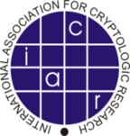
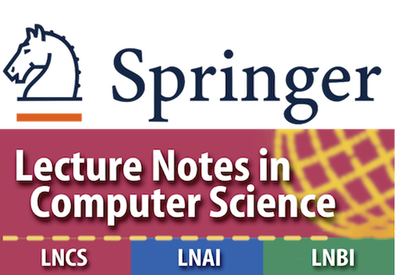

# About SAC

The [Selected Areas in Cryptography (SAC) conference series](http://sacworkshop.org/) was initiated in 1994, when the first event was held at Queen’s University in Kingston. The SAC conference has been held annually since 1994 in various Canadian locations.  The conference series is maintained by the [SAC Board](https://sacworkshop.org/contact.html).



  

SAC {{ site.data.variables.year }} is held in co-operation with the <a href="https://iacr.org">International Association for Cryptologic Research (IACR)</a>, which is the leading scholarly organization for cryptographic research.




  

The SAC proceedings are published by Springer in the <a href="https://www.springer.com/gp/computer-science/lncs">Lecture Notes in Computer Science series</a>.


## SAC {{ site.data.variables.year }} Organizers


#### {{ organizer.name }} – {{ organizer.role}}

  &nbsp;&nbsp;&nbsp;


{{ affiliation_line }} 

[{{ organizer.url }}]({{ organizer.url }})

&nbsp;



## Program committee




- <b>{{ member.name }}</b>, {{ member.affiliation }}




To be announced.

