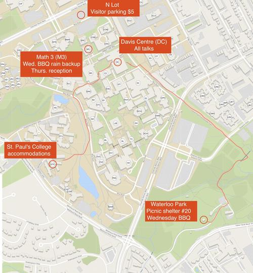

# Travel and accommodations



Selected Areas in Cryptography (SAC) 2019 and the SAC Summer School will be held on campus at the University of Waterloo, in Waterloo, Ontario, Canada.

## Location on campus

The SAC Summer School and SAC main conference take place at the University of Waterloo main campus, in the Davis Centre (DC) room 1301 and 1302. You can also access the [live map](https://uwaterloo.ca/map/?basemap=D&directions_waypoint=43.47266%2C-80.54213%2CWilliam+G.+Davis+Computer+Research+Centre+(DC)&directions_waypoint=43.47507%2C-80.54396%2CLot+N&directions_waypoint=43.46783%2C-80.54637%2CSt.+Paul%27s+University+College+(STP)&directions_waypoint=43.47327%2C-80.54405%2CMathematics+3+(M3)#map=17/43.4700/-80.5430).

## Getting to Waterloo

Find the [various ways](https://uwaterloo.ca/about/how-find-us/maps-and-directions) to get to the City of Waterloo and the campus by air, bus, car or train.

#### Getting from Toronto Pearson Airport (YYZ) to Waterloo

You can travel between Toronto Pearson Airport at Waterloo by shuttle or taxi, though note that you need to reserve in advance. Travel time is about 1.25 hours outside of rush hour. Allow 1.5-2 hours during rush hour.

- [Airways Transit](https://www.airwaystransit.com/) door-to-door service: $101/person + tip
- [City Cabs](https://prepaid.citycabs.ca/): $90-115/person + tip
- [Waterloo Taxi](http://waterlootaxi.ca/): $90-115/person + tip

There is no direct public transit between Toronto Pearson Airport and Waterloo. You can find suggested public transit connections that would take 2.5+ hours via Google Maps.

#### Visas

Non-Canadian conference attendees should check Canada's current entry requirements in advance of their travel. In particular, there is a new entry requirement that:

*"Visa-exempt foreign nationals are expected to have an Electronic Travel Authorization (eTA) to fly to or transit through Canada.  Exceptions include U.S. citizens, and travelers with a valid Canadian visa. Canadian citizens, including dual citizens, and Canadian permanent residents cannot apply for an eTA."*

[Click here](http://www.cic.gc.ca/english/visit/visas.asp) to determine whether you need an eTA, visitor visa, or nothing at all.

Check out [Visit Canada](http://www.cic.gc.ca/english/visit/) for details on border information, extending your stay and more.

Submitters who may require a visa are encouraged to begin the process early, and in particular, can contact the organizers after submission, but prior to the notification deadline to request a letter of submission.

## Accommodations

The University of Waterloo offers [on-campus accommodations](https://uwaterloo.ca/stpauls/guest-rooms-conferences) and there are several local hotels.

#### On-campus accommodations

Single-bed dorm rooms are available on campus at St. Paul’s University College. We have reserved a special rate of $55/night for bookings completed by July 8. If you're [booking on campus](https://uwaterloo.ca/stpauls/individual-room-booking-information-form), enter “SAC 2019” in the “Name of the conference” field; once you fill out the form, you will receive an email from St. Paul’s with further instructions.

#### Local hotels

[Best Western](http://bestwesternontario.com/hotels/best-western-plus-kitchener-waterloo) 
2899 King St. E. (@ Weber St.) 
Kitchener, ON N2A 1A6 
519 894-3500 

[Comfort Inn](http://www.comfortinn.com/) 
190 Weber St., N. 
Waterloo, ON N2J 3H4 
519 747-9400

[Courtyard Marriott - St. Jacobs Waterloo](http://www.marriott.com/hotels/travel/ykfcy-courtyard-waterloo-st-jacobs/) 
50 Benjamin Rd., E. 
Waterloo, ON N2V 2J9 
519 884-9295 
Toll free 800.972.5371 (North America)

[Delta Hotels - Waterloo](https://www.deltahotels.com/Hotels/Delta-Waterloo) 
110 Erb St. W. 
Waterloo, ON N2L 0C6 
519 514 0400 
Toll Free - 888-890-3222

[Destination Inn](http://www.destinationinn.com/) 
547 King St., N. 
Waterloo, ON N2L 5Z7 
519 884-0100 
Toll free: 866.222.9175

[Homewood Suites By Hilton Waterloo/St. Jacobs](http://www.homewoodsuites.com/) 
45 Benjamin Road 
Waterloo – N2V 2G8 
Tel: 519.514.0088 
Toll Free: 844 204 8627



To be announced.


